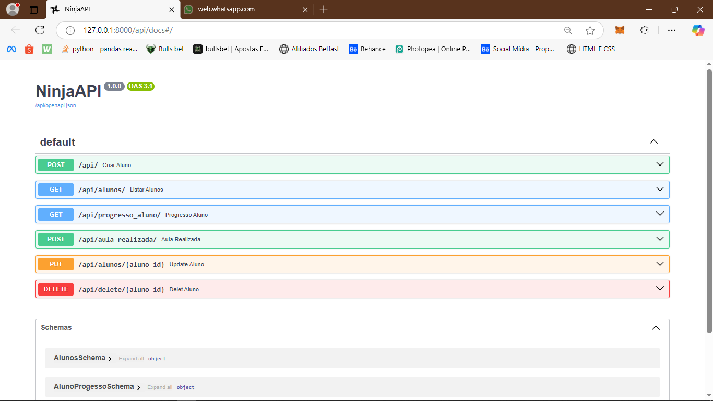

# 🎯 Sistema de Gerenciamento de Alunos - Backend

Este repositório contém a implementação do backend do **Sistema de Gerenciamento de Alunos para Academias de Artes Marciais**. O backend foi desenvolvido utilizando **Django**, **Django Ninja** e **REST API**, garantindo uma arquitetura robusta e escalável para a gestão de alunos.

## 🚀 Tecnologias Utilizadas

- **Linguagem:** Python
- **Framework:** Django
- **API:** Django Ninja (REST API)
- **Banco de Dados:** MySQL
- **Bibliotecas Auxiliares:**

## 📌 Funcionalidades

- 📌 **Cadastro de Alunos**: Criar novos alunos com nome, e-mail, faixa e data de nascimento.
- 📌 **Listagem de Alunos**: Retorna todos os alunos cadastrados.
- 📌 **Registro de Aulas Concluídas**: Permite adicionar aulas concluídas por cada aluno.
- 📌 **Consulta de Progresso**: Retorna a evolução do aluno dentro do sistema.
- 📌 **Atualização de Dados**: Permite editar informações de um aluno.
- 📌 **Deleção de Alunos**: Remove um aluno do sistema.
---

---
## 📂 Estrutura do Projeto
```
backend/
│── manage.py
│── .env
│── requirements.txt
│── config/  # Configuração do projeto
│── alunos/  # App principal
│   ├── models.py  # Modelos do banco de dados
│   ├── views.py  # Views da API
│   ├── urls.py  # Rotas
│   ├── serializers.py  # Serialização dos dados
│── db.sqlite3  # Banco de dados SQLite para desenvolvimento
```

## 🛠️ Endpoints Principais

| Método | Endpoint | Descrição |
|---------|----------|------------|
| **POST** | `/api//` | Criar um novo aluno |
| **GET** | `/api/alunos/` | Listar todos os alunos |
| **GET** | `/api/progresso_aluno/{id}/` | Consultar um aluno específico |
| **POST** | `/api/aula_realizada/{id}/` | Marca aula como realizada |
| **PUT** | `/api/alunos/{id}/` | Atualizar informações de um aluno |
| **DELETE** | `/api/delete/{id}/` | Remover um aluno |

## ✅ Melhorias Futuras
- Implementação de autenticação JWT.
- Paginação na listagem de alunos.
- Melhorias na segurança da API.

📬**Contato: Caso tenha dúvidas, entre em contato!** 🚀

**Email:** barbosa.nilsonneto@gmail.com
**X:** @Nilsonbarbozza
**Whatsapp:** (084) 9970-0898
